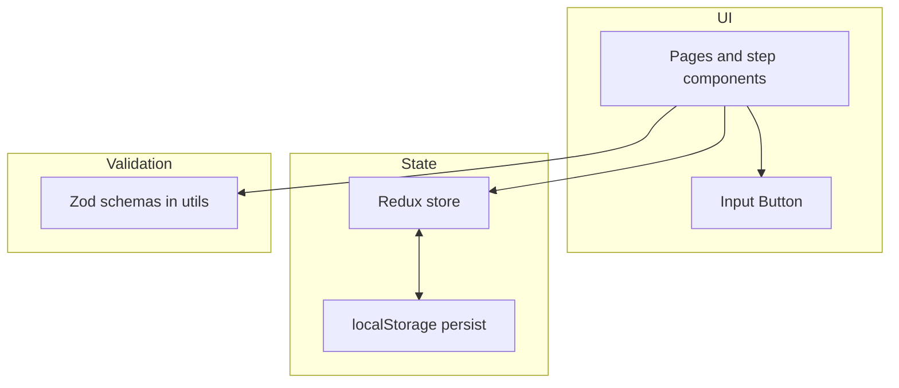

# Onboarding multistep form

A React + TypeScript demo app: sign in, complete a four-step onboarding flow (profile, songs, payment, success), then land on a simple home screen. State is persisted in **localStorage** (no backend).

## Features

- **Auth (demo):** Login checks fixed demo credentials in the client only.
- **Onboarding steps:** Profile, songs, and payment validated with **Zod**; payment uses Luhn + expiry helpers; songs step uses **Formik** with a Zod-backed `validate` function; success screen.
- **Routing:** Protected routes for onboarding vs home based on auth and completion flags.
- **UI:** Shared `Input` and `Button` components, accessible error messaging (`aria-invalid`, `role="alert"` where appropriate).
- **Quality:** ESLint runs before production build.

## Tech stack

- React 19, Vite 8, TypeScript
- Redux Toolkit + React Redux, persisted store
- React Router 7
- Formik (songs step), Zod (validation schemas in `src/utils`)
- ESLint 9 (flat config)

## Prerequisites

- **Node.js** 20+ (LTS recommended)
- **npm** 10+

## Scripts

| Command        | Description                                      |
| -------------- | ------------------------------------------------ |
| `npm install`  | Install dependencies                             |
| `npm run dev`  | Start Vite dev server                              |
| `npm run build`| Lint, typecheck (`tsc -b`), production Vite build |
| `npm run lint` | ESLint                                           |
| `npm run preview` | Serve the production build locally            |

## Demo login

After `npm run dev`, open the URL shown in the terminal (usually `http://localhost:5173`).

| Field    | Value         |
| -------- | ------------- |
| Username | `user123`     |
| Password | `password123` |

## Push this project to GitHub

## Project layout (high level)

```
src/
  components/     # Input, Button
  constants/      # Demo credentials
  onboarding/     # Steps + onboarding page shell
  pages/          # Welcome, Login, Home
  routing/        # Auth / onboarding route guards
  store/          # Redux slices, persist, store factory
  utils/          # Zod schemas, payment helpers, shared Zod error mapping
```

## Project architecture

This app is a **client-only SPA** (no API). Layers and responsibilities:

1. **Entry & shell** — `main.tsx` mounts React with `StrictMode`, wraps the tree in the Redux `Provider`, and loads global styles. `App.tsx` owns the **router** and route table only.

2. **Routing & access control** — `react-router-dom` defines paths (`/`, `/login`, `/onboarding`, `/home`). Small **route guard** components in `src/routing/` compose auth and onboarding state:
   - `RequireAuth` — must be logged in.
   - `RequireIncompleteOnboarding` — onboarding not finished (for the wizard).
   - `RequireOnboardingComplete` — onboarding finished (for home).
   - `RootRedirect` — logged-out users see **`WelcomePage`** at `/` with a **Sign in** action; signed-in users are sent to onboarding or home. `LoginRoute` handles `/login` and redirects if already signed in.

3. **Global state** — **Redux Toolkit** in `src/store/`: `authSlice` (logged in or not), `onboardingSlice` (step index, profile, songs, payment, completion). **`persist.ts`** rehydrates/writes slices to **localStorage** so refresh keeps progress.

4. **Screens** — **Pages** (`LoginPage`, `HomePage`) and **onboarding steps** (`StepPersonal`, `StepSongs`, `StepPayment`, `StepSuccess`) are mostly presentational: they dispatch actions, read selectors, and render forms. **`OnboardingPage`** is a thin shell: step indicator + which step component to show from `currentStep`.

5. **Forms & validation** — Profile and payment inputs are **controlled from Redux**. Login uses local React state + **`validateLoginFields`** (Zod). Songs use **Formik** for the dynamic list + **`validateSongsForm`** (Zod). Shared **`mapZodFieldErrors`** maps `ZodError` issues to per-field strings for login/profile/payment. Reusable **`Input`** / **`Button`** in `src/components/`.

6. **Build & quality** — **Vite** bundles the app; **TypeScript** `tsc -b` typechecks; **ESLint** runs as part of `npm run build`.



